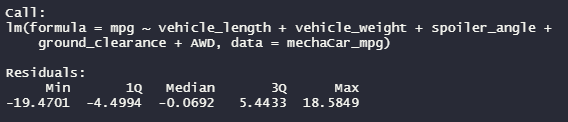
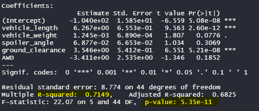

# MechaCar_Statistical_Analysis

Perform a statistical analysis of automobile performance using R

## Overview

## Analysis

### Linear Regression to Predict MPG

- Vehicle Length and Ground Clearance show a non-random amount of variance on the MPG of the MechaCar
- The slope of the linear model is not considered to be zero. The p-value of the linear model is lower than an extrememe level of significance. This provides sufficient statistical evidence that the null hypotheses is not true. The relationship between our variables and miles per gallon is subject to more than random chance.
- The r-squared value is .7149 indicating that there is a 71.48% chance that any future data points will fit this model. The linear model does predict the MechaCar prototypes effectively. There is most likely still unconsidered factors but the model is relatively effective. 
