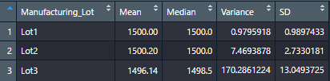
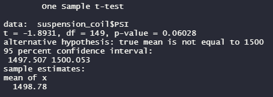
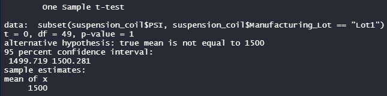
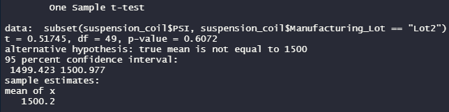
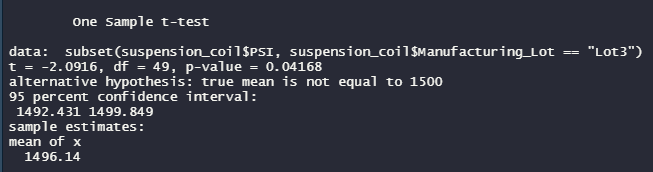

# MechaCar_Statistical_Analysis

Perform a statistical analysis of automobile performance using R

## Linear Regression to Predict MPG

- Vehicle Length and Ground Clearance show a non-random amount of variance on the MPG of the MechaCar
- The slope of the linear model is not considered to be zero. The p-value of the linear model is lower than an extrememe level of significance. This provides sufficient statistical evidence that the null hypotheses is not true. The relationship between our variables and miles per gallon is subject to more than random chance.
- The r-squared value is .7149 indicating that there is a 71.48% chance that any future data points will fit this model. The linear model does predict the MechaCar prototypes effectively. There is most likely still unconsidered factors but the model is relatively effective. 

## Summary Statistics on Suspension Coils

#### Total Summary

#### Lot Summary

- The specs for the MechaCoil suspension coils dictate that the variance of the suspension coils must not exceed 100 psi. Based on the Total Summary, the overall variance is below 100 psi and therefore meets the specifications. However, the lot summary stats shows that the variance for Lot 3 is well over the acceptable threshold (170.29)

## T-Tests on Suspension Coils

#### Suspension Coils cumulative T-Test

- The T-Test across all the lots shows they are not a statistically different from the population mean of 1500. We can't reject the null hypothesis because the p-value is not low enough (0.06028)

#### Lot 1 T-Test

- The same conclusion can be made looking at the T-Test for Lot 1 with a p value of 1.

#### Lot 2 T-Test

- The same conclusion is reached as before (p-value = 0.6072)

#### Lot 3 T-Test

- T-Tests of Lot 3 show that the suspension coils are slightly statistically different from the population mean. The p-value (0.0417) is low enough to reject the null hypothesis. Further analysis of this lot might be necessary or it might need to be discarded.

## Study Design: MechaCar vs Competition

